# Basemaps, eh?: A guide to creating Canadian basemaps using {rcanvec}, {rosm} and {prettymapr}

The R packages {rcanvec}, {rosm} and {prettymapr} are all about creating simple, easy-to-read maps without spending too much time finding data to use as a basemap. If you're writing a thesis, think about it as Figure 1 (where in the world is your study site) and Figure 2 (here's my study site). This tutorial is designed as a primer to highlight the basic functions of these three packages - for more detailed information see the PDF manuals for [rcanvec](https://github.com/paleolimbot/rcanvec/files/15517/rcanvec_0.1.3-manual.pdf), [rosm](https://github.com/paleolimbot/rosm/files/16812/rosm_0.1.2-manual.pdf), and [prettymapr](https://github.com/paleolimbot/prettymapr/files/11433/prettymapr_0.1.1-manual.pdf). Feel free to follow along using [tutorial.R](tutorial.R) or [tutorial_answers.R](tutorial_answers.R). Also, consider supporting R package development by [giving me money](http://apps.fishandwhistle.net/donate) (I'm a starving grad student, I promise).

##Install the packages
See if you can install the packages - they're on CRAN and should be available for most verions of R. Updating R is a pain, but it may be what you have to do to make sure you can install the packages.
```
install.packages("prettymapr")
install.packages("rosm")
install.packages("rcanvec")
```
Later on you'll also need some data, which you can find in the [tutorial notes](rcanvec_tutorial.zip).

##Base plotting

Part of being easy to use means these packages work well with the {sp} package, or any other package that uses base plotting in R (e.g. {marmap}, {cartography}, {OpenStreetMap}). Because of this, it's worth taking a look at how to use the `plot()` function and a few related methods. First, we'll setup the data we'll use in our examples.

```
#setup data
xs <- c(-64.35134, -64.36888, -64.35984)
ys <- c(45.06345, 45.08933, 45.09176)
mylabels <- c("Graveyard", "Huggins", "TAN")
```

###plot()
The `plot(x, y)` command creates a new plot and plots its arguments as points. Usually {rcanvec} or {rosm} will take care of creating the initial plot, but it's worth knowing that behind the scenes, this is what's happening. You can use `xlim=c(X, X)`, and `ylim=c(X, X)` to change the extents of the plot.
```
#plot x and y points
plot(xs, ys)
```
Now that we have our basic plot, we'll use a few other functions to draw on top of the plot we have just created.

###points()
It's a bit redundant to add points on top of the ones we've just created, but often you'll want to add points to a plot without creating a new one. The syntax is exactly the same as for `plot()`. Use `cex` (or **c**haracter **ex**pantion factor) to make your points bigger, `pch` (or '**p**lotting **ch**aracter'; see this [Quick-R](http://www.statmethods.net/advgraphs/parameters.html) page for options) to change the symbol, or `col` to change the **col**our (try "black", "white", "#554499", etc.).
```
#add points
points(xs, ys, pch=2)
```

###arrows()
This does exactly what you'd think: draw an arrow from `x1, y1` to `x2, y2`. Use the `length` argument to make the arrows bigger or smaller (in inches).
```
#draw an arrow from "Graveyard" to "Huggins"
arrows(xs[1], ys[1], xs[2], ys[2])
```

###lines()
If you'd like to connect your points with lines, the `lines()` function is for you! In addition to the `col` argument, we can also pass `lwd` (**l**ine **w**i**d**th; try from 0.5 to 2), or `lty` (**l**ine **ty**pe; you can pick [any number from 0 to 6](http://www.statmethods.net/advgraphs/parameters.html)).
```
#add lines from the graveyard to huggins to TAN.
lines(xs, ys)
```

###text()
Labels are often useful, and adding them to the map is no problem. Use `cex` to control font size (try from 0.5 to 2), `col` to control colour, and `adj` to offset the label. Generally you will want to use `adj=c(-0.2, 0.5)`, which will offset the label to the right of your points.
```
#add labels
text(xs, ys, labels=mylabels)
```

###polygon()
As advertized, creates a polygon based on the verticies provided. Try `border` to change the border colour, `col` to change the fill colour, `lty` to change the border line type, and `lwd` to change the border line width.
```
#add a polygon between the three points
polygon(xs, ys, col="green", border="red")
```

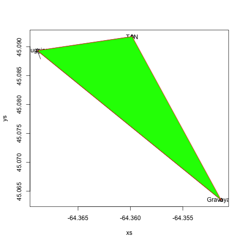

###locator()
Often it's desirable to place something on the plot that you don't necessarily know the coordinates to. To find these coordinates, we can capture mouse clicks on a plot using the `locator()` function. This will return a `data.frame` of XY coordinates of the points we clicked on. Remember to hit **ESC** when done!
```
#use locator() to find points (hit ESC when done!)
locator()
```
It's also possible to capture this to a variable, but you'll eventually want to somehow hardcode these values into your script (because you won't want to click on the map every single time you run your script).

###More Resources
There are numerous graphical parameters you can pass to these functions, which are documented in great detail at [Quick-R](http://www.statmethods.net/advgraphs/parameters.html) and in the [R man page for par](https://stat.ethz.ch/R-manual/R-devel/library/graphics/html/par.html). The same parameters will be used when you plot spatial data, so it's worth becoming familiar with how to make points, lines, and polygons the way you'd like them to look.

##Plotting Spatial Data
The {rgdal} and {sp} packages provide a powerful engine to render all kinds of geographical data. The data used in this section can be found in the [tutorial notes](rcanvec_tutorial.zip) you've hopefully already downloaded. First, we'll have to load the packages.
```
#load packages
library(sp)
library(rgdal)
```
Next, we'll load the data. `readOGR()` from the {rgdal} package lets us load shapefiles, among many other data types. The syntax is a bit tricky, but for shapefiles `dsn` is the folder that contains your shapefile, and `layer` is the name of the shapefile (without the ".shp").
```
#use rgdal::readOGR() to read shapefile
altashoreline <- readOGR(dsn="data", layer="alta_shoreline") #dsn=SOURCE FOLDER, #layer=FILENAME (minus .shp)
```
Once we've loaded the data, we can plot it. Use the graphical parameters such as `col`, `border`, and `lwd` we discussed earlier to make the data look decent. You can also use `axes`, `xlim`, and `ylim` to customize the appearance of the plot and extents, respectively. With this plot command we can also use `add=TRUE` to plot another file on top (instead of creating a new plot).
```
#plot data
plot(altashoreline, col="lightblue")
```
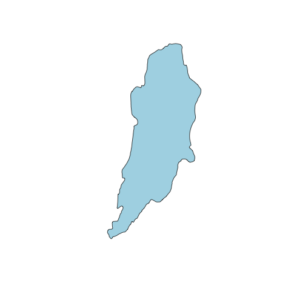

Now that we've plotted our base data, we can draw on top of it using `lines()`, `polygon()`, `arrows()`, and `text()`. As an example, we'll load a file containing the locations of my masters thesis sample locations.
```
#plot Alta Lake and cores
altacores <- read.delim("data/alta_cores.txt")
points(altacores$lon, altacores$lat, pch=15, cex=0.6)
text(altacores$lon, altacores$lat, labels=altacores$name, adj=c(-0.2, 0.5), cex=0.5)
```


##Using {rosm} to plot basemaps

The {rosm} package pulls [Bing Maps](https://www.bing.com/maps/), [Open Street Map](https://www.openstreetmap.org/), and [related maps](http://wiki.openstreetmap.org/wiki/Tile_servers) from the internet, caches them locally, and renders them to provide context to overlying data (your sample sites, etc.). Again, for details, take a look at the [{rosm} manual](https://github.com/paleolimbot/rosm/files/16812/rosm_0.1.2-manual.pdf). First we'll load the packages.
```
library(prettymapr)
library(rosm)
```
###Step 1: Find your bounding box
The {rosm} package plots based on a **bounding box**, or an area that you would like to be visible. There's a few ways to go about doing this, but the easiest way is to visit the [Open Street Maps Export page](http://www.openstreetmap.org/export), zoom to your area of interest, and copy/paste the values into `makebbox(northlat, eastlon, southlat, westlon)` from the {prettymapr} package. You can also use `searchbbox("my location name", source="google")`, also from the {prettymapr} package, which will query google for an appropriate bounding box. You'll notice that the bounding box returned by these methods is just a 2x2 matrix, the same as that returned by bbox() in the {sp} package.
```
altalake <- makebbox(50.1232, -122.9574, 50.1035, -123.0042)
#or
altalake <- searchbbox("alta lake, BC", source="google")
```
Make sure you've got your bounding box right by trying `osm.plot()` or `bmaps.plot()` with the bounding box as your first argument.
```
osm.plot(altalake)
bmaps.plot(altalake)
```
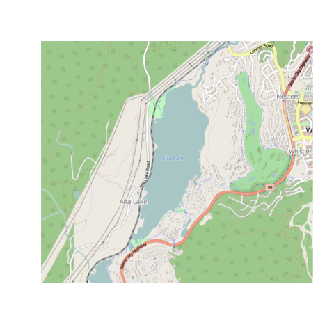
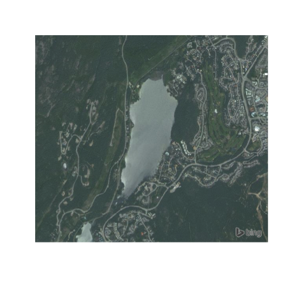

###Step 2: Choose your map type and zoom level
{rosm} provides access to a number of map types (and even the ability to load your own if you're savvy!), but the most common ones you'll use are `type=osm`, `type="hillshade"`, `type=stamenwatercolor`, and `type=stamenbw` for `osm.plot()` and `type="Aerial"` with `bmaps.plot()`. Look at all of them with `osm.types()` and `bmaps.types()`.
```
osm.types()
osm.plot(altalake, type="stamenbw")

bmaps.types()
bmaps.plot(altalake, type="AerialWithLabels")
```
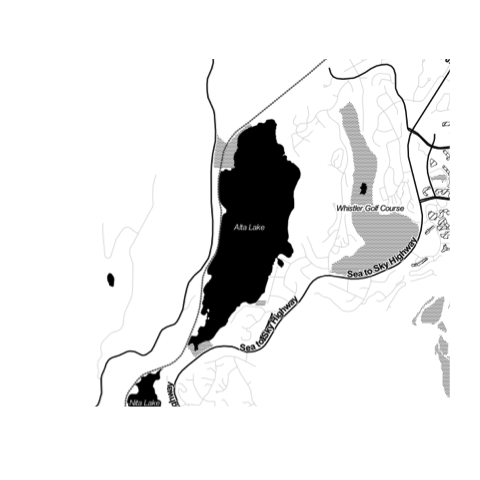
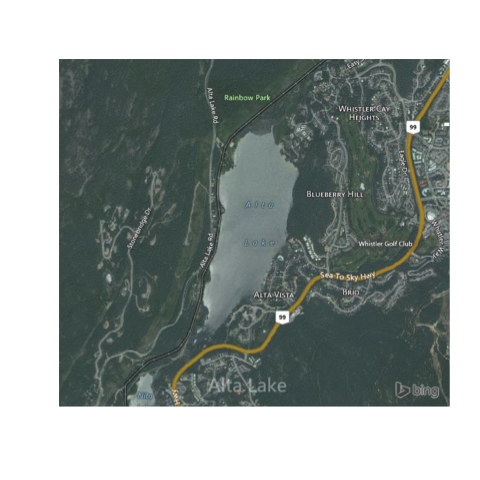

The next thing we'll adjust is the zoom level. The zoom level (level of detail) is calculated automatically, but it may be that you're looking for higher (or lower) resolution. To specify a resolution specifically, use `res=300` (where 300 is the resolution in dpi; useful when exporting figures), or `zoomin=1`, which will use the automatically specified zoom level and zoom in 1 more.
```
bmaps.plot(altalake, zoomin=1)
bmaps.plot(altalake, res=300)
```

###Step 3: Add overlays
Next we'll use the `lines()`, `polygon()`, `arrows()`, and `text()` functions we went over earlier to draw on top of the map we've just plotted. What's important here is that we specifically have to tell {rosm} that we don't want it to project our data (if you plot with axes=TRUE you'll see that osm.plot() is not plotting in lat/lon. It's plotting in EPSG:3857...which you don't need to understand but may be useful if you do happen to understand it). This sounds intimidating but it's actually very easy:
```
#plot without projecting
osm.plot(altalake, project=FALSE)
bmaps.plot(altalake, project=FALSE)
```
Now we can add our overlays.
```
points(altacores$lon, altacores$lat, pch=15, cex=0.6)
text(altacores$lon, altacores$lat, labels=altacores$name, adj=c(-0.2, 0.5), cex=0.5)
```


###Step 5: Putting it all together
Putting it all together, an example plotting script might like this:

```
library(prettymapr)
library(rosm)

#Find bounding box
altalake <- makebbox(50.1232, -122.9574, 50.1035, -123.0042)
#Plot Bing Maps Aerial
bmaps.plot(altalake, res=300, project=FALSE, stoponlargerequest=FALSE)
#Plot overlays
points(altacores$lon, altacores$lat, pch=15, cex=0.6)
text(altacores$lon, altacores$lat, labels=altacores$name, adj=c(-0.2, 0.5), cex=0.5)
```
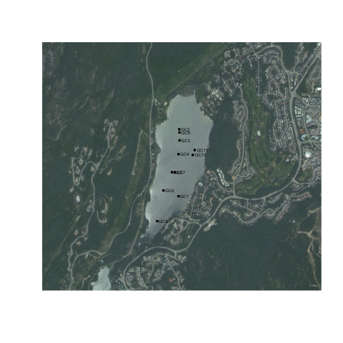

You'll notice that it still doesn't have a scale bar or north arrow, and the margins aren't exactly how we'd like them. It's possible to eliminate margins manually using `par(mar=c(0,0,0,0), oma=c(0,0,0,0))`, and add a scale bar using the `addscalebar()` function (in the {prettymapr} package), but the easiest way is to use the `prettymap()` function in {prettymapr} to do it all in one step. This might look like the following:

```
library(prettymapr)
library(rosm)

altalake <- makebbox(50.1232, -122.9574, 50.1035, -123.0042)
prettymap({bmaps.plot(altalake, res=300, project=FALSE, stoponlargerequest=FALSE)
           points(altacores$lon, altacores$lat, pch=15, cex=0.6)
           text(altacores$lon, altacores$lat, labels=altacores$name, adj=c(-0.2, 0.5), cex=0.5)})
```
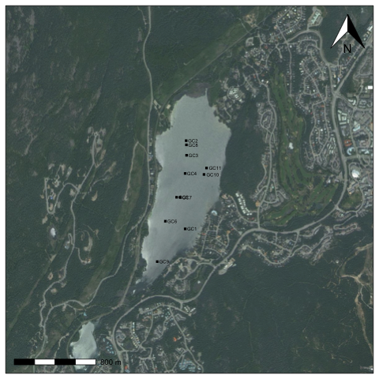

There's tons of options for `prettymap()` that let you customize the north arrow, scale bar etc., which you can find in the [{prettymapr} manual](https://github.com/paleolimbot/prettymapr/files/11433/prettymapr_0.1.1-manual.pdf).

##Using {rcanvec} plot basemaps
The {rcanvec} package provides access to data produced by the Canadian government (the CanVec+ dataset) that is useful for creating basemaps for small-scale locations in Canada. If you're not in Canada, this won't help you much. Similarly, if you're trying to make a map of Ontario, this is not the package for you. The site we've been looking at so far (Alta Lake, near Whistler BC) is a couple of kilometres wide, which is about right in terms of scale. It also may be that you just want to download some data to use in an external GIS (like Arc or QGIS), in which case this package will happily export the data for you. Let's get started by loading the packages:
```
library(prettymapr)
library(rcanvec)
```

###Step 1: Find your bounding box

The {rcanvec} package plots based on a **bounding box**, or an area that you would like to be visible. There's a few ways to go about doing this, but the easiest way is to visit the [Open Street Maps Export page](http://www.openstreetmap.org/export), zoom to your area of interest, and copy/paste the values into `makebbox(northlat, eastlon, southlat, westlon)` from the {prettymapr} package. You can also use `searchbbox("my location name", source="google")`, also from the {prettymapr} package, which will query google for an appropriate bounding box. You'll notice that the bounding box returned by these methods is just a 2x2 matrix, the same as that returned by bbox() in the {sp} package.
```
altalake <- makebbox(50.1232, -122.9574, 50.1035, -123.0042)
#or
altalake <- searchbbox("alta lake, BC", source="google")
```
Back in the days of paper maps, NTS references were used to number maps in an orderly way. For example, the "Wolfville" 1:50,000 scale mapsheet would be referred to as "021H01", and our mapsheets for Alta Lake in BC would be 092J02 and 092J03. If you don't know what these are it's still ok, but this is how the government organizes the data. Take a minute to get familiar with your NTS reference(s), if you feel into it.
```
#get a list of NTS references based on a bounding box
nts(bbox=altalake)
```
If you run this command and your bounding box returns more than 4 mapsheets, you're probably going to want to zoom in. If you're looking to export your data, you'll need to have some idea of what these are.

###Step 2: Preview your map
{rcanvec} has a method to quickly plot a bounding box: `canvec.qplot()`. We'll pass our bounding box as the `bbox` argument, and we can use the `layers` argument to customize our layers. If things take too long to plot, you may want to just use `layers="waterbody"` (the "road" layer in particular usually takes a long time to plot). Layers you may want to use are "waterbody", "forest", "river", "contour", "building" and "road". Note that the order you put them in will change the appearance of the map.
```
canvec.qplot(bbox=altalake)
canvec.qplot(bbox=altalake, layers=c("waterbody", "river"))
```
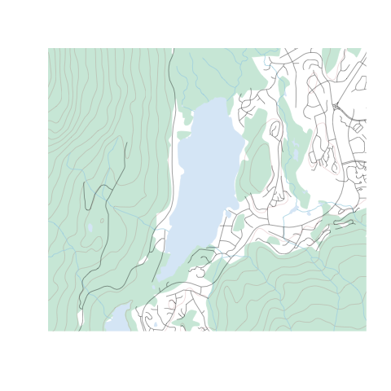
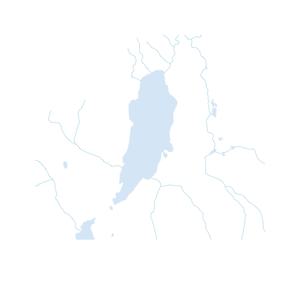

###Step 3: Refine your plotting options (optional)
It's possible (but not at all necessary) to load layers individually and plot them manually, giving us more control over the appearance of the map. You'll have to have called `canvec.qplot(bbox=XX)` or `canvec.download(nts(bbox=XX))` before you can load a layer.
```
waterbody <- canvec.load(nts(bbox=altalake), layerid="waterbody")
rivers <- canvec.load(nts(bbox=altalake), layerid="river")
forest <- canvec.load(nts(bbox=altalake), layerid="forest")
```
Using the graphic parameters such as `col` and `border`, we can plot our data manually. Note you'll have to use `xlim` and `ylim` arguments to zoom in. Also, for all calls to `plot()` after the first one, you'll have to pass `add=TRUE` or it will create a new plot. Because we're dealing with 2 mapsheets, canvec.load() returns a list of layers, and if you don't understand that you should pobably stick to using canvec.qplot().
```
library(sp) #needed to load sp::plot

plot(waterbody[[2]], col="lightblue", border=0, xlim=altalake[1,], ylim=altalake[2,])
plot(forest[[2]], col="#D0EADD", border=0, add=TRUE)
plot(rivers[[2]], col="lightblue", add=TRUE)
```
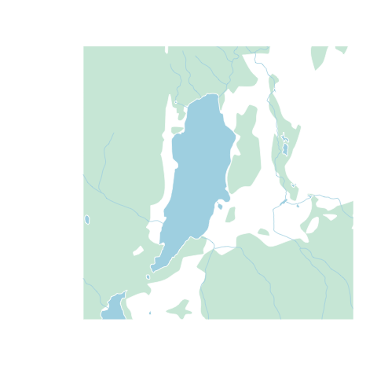

If you'd still like to use the `canvec.qplot()` function, it's also possible to build this customization as a "list of lists", best shown by example:
```
plotoptions = list()
plotoptions$waterbody <- list(col="lightblue", border=0)
plotoptions$forest <- list(col="#D0EADD", border="#D0EADD")
plotoptions$river <- list(col="lightblue")

canvec.qplot(bbox=altalake, layers=c("waterbody", "forest", "river"), options=plotoptions)
```


###Step 4: Add overlays
Next we'll use the `lines()`, `polygon()`, `arrows()`, and `text()` functions we went over earlier to draw on top of the map we've just plotted. Unlike {rosm}, {rcanvec} plots in lat/lon natively, so we don't have to worry about projections.
```
points(altacores$lon, altacores$lat, pch=15, cex=0.6)
text(altacores$lon, altacores$lat, labels=altacores$name, adj=c(-0.2, 0.5), cex=0.5)
```
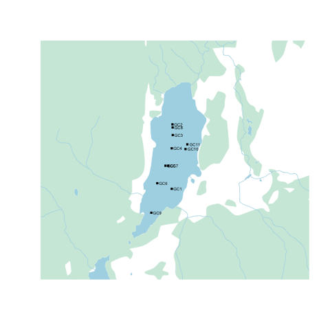

A neat trick is to use the {rosm} package to add a hillshade on top of our map, which we would normally do before plotting our overlays. We'll have to tell `osm.plot()` not to project its data, since we're already in lat/lon.
```
osm.plot(altalake, type="hillshade", project=FALSE, add=TRUE)
```
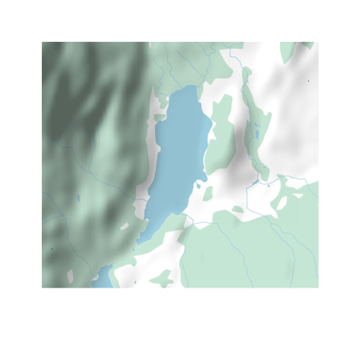

###Step 5: Putting it all together
Putting it all together, an example plotting script might like this:

```
library(prettymapr)
library(rcanvec)
library(rosm)

#Find bounding box
altalake <- makebbox(50.1232, -122.9574, 50.1035, -123.0042)
#Plot waterbody, forest, river, road
canvec.qplot(bbox=altalake, layers=c("waterbody", "forest", "river", "road"))
#Plot overlays
osm.plot(altalake, type="hillshade", project=FALSE, add=TRUE)
points(altacores$lon, altacores$lat, pch=15, cex=0.6)
text(altacores$lon, altacores$lat, labels=altacores$name, adj=c(-0.2, 0.5), cex=0.5)
```
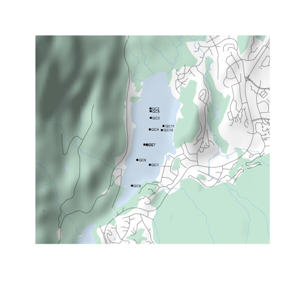

You'll notice that it still doesn't have a scale bar or north arrow, and the margins aren't exactly how we'd like them. It's possible to eliminate margins manually using `par(mar=c(0,0,0,0), oma=c(0,0,0,0))`, and add a scale bar using the `addscalebar()` function (in the {prettymapr} package), but the easiest way is to use the `prettymap()` function in {prettymapr} to do it all in one step. This might look like the following:

```
library(prettymapr)
library(rosm)
library(rcanvec)

altalake <- makebbox(50.1232, -122.9574, 50.1035, -123.0042)
prettymap({canvec.qplot(bbox=altalake, layers=c("waterbody", "forest", "river", "road"))
            osm.plot(altalake, type="hillshade", project=FALSE, add=TRUE)
            points(altacores$lon, altacores$lat, pch=15, cex=0.6)
            text(altacores$lon, altacores$lat, labels=altacores$name, adj=c(-0.2, 0.5), cex=0.5)})
```
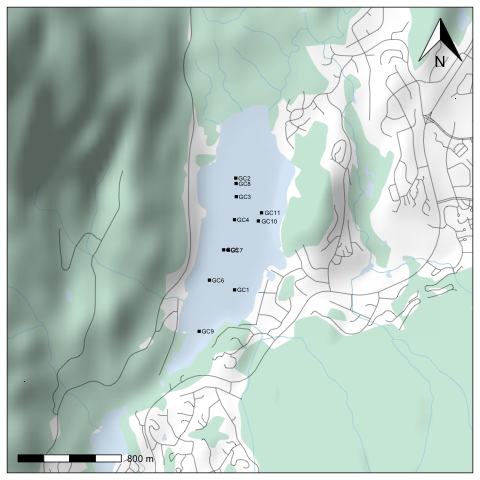

There's tons of options for `prettymap()` that let you customize the north arrow, scale bar etc., which you can find in the [{prettymapr} manual](https://github.com/paleolimbot/prettymapr/files/11433/prettymapr_0.1.1-manual.pdf).
